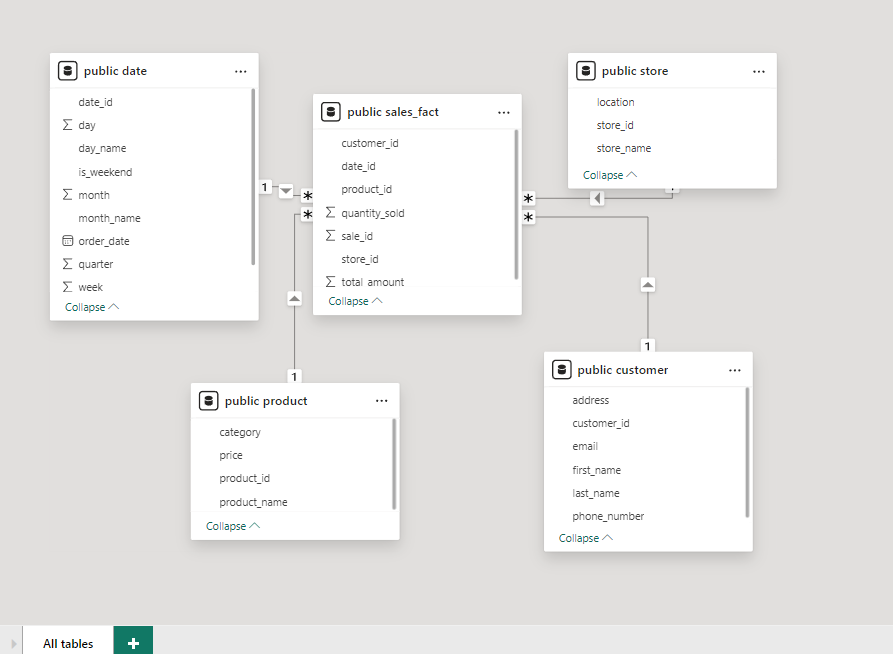

# Retail Insights in 2023

#### Project Overview
This project amins to create a comprehensive data warehouse for retail saels analysis. The data warehouse integrates
various data sources, allowing for detailed insights and visualizations of sales performance across different
dimensions such as date, product, store and customer. 

#### Data Warehouse Schema

#### Tools Used in This Project
    Jupyter Notebook
    Excel
    Apache Nifi
    PostGreSQL
    Power Bi

#### Data Generation and Loading

##### Data Generation
Python scripts were used to generate synthetic data for the dimension tables (customer, date_dim, product, store) and the fact table (sales_fact):
    Customer Dimension: Generated using Faker library to create realistic customer profiles.
    Date Dimension: Generated for the year 2023, including additional date-related attributes.
    Product Dimension: A predefined list of products with their categories and prices.
    Store Dimension: A predefined list of store names and locations.
    Sales Fact: Generated by simulating sales transactions, ensuring foreign key integrity and realistic sales data.

##### Data Loading
Data was initially stored in CSV files and then imported into a PostgreSQL database using Apache NiFi for efficient data pipeline management.

##### Power BI Dashboard
A Power BI dashboard was created to visualize the retail sales data, providing key insights such as:

    Total Sales Amount: A KPI card displaying the sum of total sales.
    Sales by Store: A bar chart showing the sum of total sales amount by store.
    Sales by Month: A line chart depicting the sum of total sales amount by month.
    Sales by Product: A bar chart illustrating the sum of total sales amount by product.

#### Steps to Reproduce
Database Setup:
    Install PostgreSQL and create a new database.
    Create the dimension and fact tables using the provided SQL scripts.
Data Generation:
    Run the provided Python scripts to generate data and store it in CSV files.
Data Loading:
    Use Apache NiFi to create a data pipeline that loads data from the CSV files into the PostgreSQL database.
Visualization:
    Connect Power BI to the PostgreSQL database.
    Create the suggested visualizations and build the dashboard.

#### Conclusion
This project demonstrates the end-to-end process of creating a local data warehouse, from data generation and loading to visualization and analysis. The resulting Power BI dashboard provides valuable insights into retail sales performance for the year 2023.
